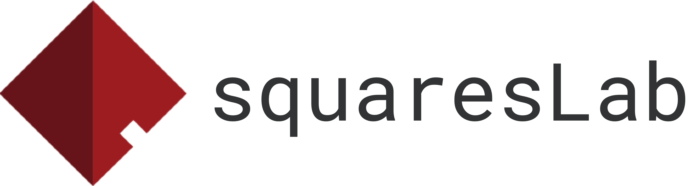

<div align="center">
  <a href="https://squareslab.github.io/"></a>
  &emsp;&emsp;&emsp;
  <a href="https://cmustrudel.github.io/"></a>
</div>

---

<div align="center">

[](https://github.com/squaresLab/VarCLR/actions/workflows/test.yml)
[](https://github.com/squaresLab/VarCLR/stargazers)
[](https://github.com/squaresLab/VarCLR/blob/master/LICENSE)
[](https://github.com/ambv/black)

</div>

## VarCLR: Variable Representation Pre-training via Contrastive Learning

**New:** Paper accepted by ICSE 2022. Preprint coming soon!

This repository contains code and pre-trained models for VarCLR, a contrastive learning based approach for learning semantic representations of variable names that effectively captures variable similarity, with state-of-the-art results on [IdBench@ICSE2021](https://conf.researchr.org/details/icse-2021/icse-2021-papers/3/IdBench-Evaluating-Semantic-Representations-of-Identifier-Names-in-Source-Code).

- [VarCLR: Variable Representation Pre-training via Contrastive Learning](#varclr-variable-representation-pre-training-via-contrastive-learning)
  - [Step 0: Install](#step-0-install)
  - [Step 1: Load a Pre-trained VarCLR Model](#step-1-load-a-pre-trained-varclr-model)
  - [Step 2: VarCLR Variable Embeddings](#step-2-varclr-variable-embeddings)
    - [Get embedding of one variable](#get-embedding-of-one-variable)
    - [Get embeddings of list of variables (supports batching)](#get-embeddings-of-list-of-variables-supports-batching)
  - [Step 2: Get VarCLR Similarity Scores](#step-2-get-varclr-similarity-scores)
    - [Get similarity scores of N variable pairs](#get-similarity-scores-of-n-variable-pairs)
    - [Get pairwise (N * M) similarity scores from two lists of variables](#get-pairwise-n--m-similarity-scores-from-two-lists-of-variables)
  - [Step 3: Reproduce IdBench Benchmark Results](#step-3-reproduce-idbench-benchmark-results)
    - [Load the IdBench benchmark](#load-the-idbench-benchmark)
    - [Compute VarCLR scores and evaluate](#compute-varclr-scores-and-evaluate)
    - [Let's compare with the original CodeBERT](#lets-compare-with-the-original-codebert)
  - [Results on IdBench benchmarks](#results-on-idbench-benchmarks)
    - [Similarity](#similarity)
    - [Relatedness](#relatedness)
  - [Pre-train your own VarCLR models](#pre-train-your-own-varclr-models)
  - [Cite](#cite)

### Step 0: Install

```bash
pip install -e .
```

### Step 1: Load a Pre-trained VarCLR Model

```python
from varclr.models import Encoder
model = Encoder.from_pretrained("varclr-codebert")
```

### Step 2: VarCLR Variable Embeddings

#### Get embedding of one variable

```python
emb = model.encode("squareslab")
print(emb.shape)
# torch.Size([1, 768])
```

#### Get embeddings of list of variables (supports batching)

```python
emb = model.encode(["squareslab", "strudel"])
print(emb.shape)
# torch.Size([2, 768])
```

### Step 2: Get VarCLR Similarity Scores

#### Get similarity scores of N variable pairs

```python
print(model.score("squareslab", "strudel"))
# [0.42812108993530273]
print(model.score(["squareslab", "average", "max", "max"], ["strudel", "mean", "min", "maximum"]))
# [0.42812108993530273, 0.8849745988845825, 0.8035818338394165, 0.889922022819519]
```

#### Get pairwise (N * M) similarity scores from two lists of variables

```python
variable_list = ["squareslab", "strudel", "neulab"]
print(model.cross_score("squareslab", variable_list))
# [[1.0000007152557373, 0.4281214475631714, 0.7207341194152832]]
print(model.cross_score(variable_list, variable_list))
# [[1.0000007152557373, 0.4281214475631714, 0.7207341194152832],
#  [0.4281214475631714, 1.0000004768371582, 0.549992561340332],
#  [0.7207341194152832, 0.549992561340332, 1.000000238418579]]
```

### Step 3: Reproduce IdBench Benchmark Results

#### Load the IdBench benchmark

```python
from varclr.benchmarks import Benchmark

# Similarity on IdBench-Medium
b1 = Benchmark.build("idbench", variant="medium", metric="similarity")
# Relatedness on IdBench-Large
b2 = Benchmark.build("idbench", variant="large", metric="relatedness")
```

#### Compute VarCLR scores and evaluate

```python
id1_list, id2_list = b1.get_inputs()
predicted = model.score(id1_list, id2_list)
print(b1.evaluate(predicted))
# {'spearmanr': 0.5248567181503295, 'pearsonr': 0.5249843473193132}

print(b2.evaluate(model.score(*b2.get_inputs())))
# {'spearmanr': 0.8012168379981921, 'pearsonr': 0.8021791703187449}
```

#### Let's compare with the original [CodeBERT](https://github.com/microsoft/CodeBERT)

```python
codebert = Encoder.from_pretrained("codebert")
print(b1.evaluate(codebert.score(*b1.get_inputs())))
# {'spearmanr': 0.2056582946575104, 'pearsonr': 0.1995058696927054}
print(b2.evaluate(codebert.score(*b2.get_inputs())))
# {'spearmanr': 0.3909218857993804, 'pearsonr': 0.3378219622284688}
```

### Results on [IdBench](https://conf.researchr.org/details/icse-2021/icse-2021-papers/3/IdBench-Evaluating-Semantic-Representations-of-Identifier-Names-in-Source-Code) benchmarks

#### Similarity

| Method           | Small    | Medium   | Large    |
| ---------------- | -------- | -------- | -------- |
| FT-SG            | 0.30     | 0.29     | 0.28     |
| LV               | 0.32     | 0.30     | 0.30     |
| FT-cbow          | 0.35     | 0.38     | 0.38     |
| VarCLR-Avg       | 0.47     | 0.45     | 0.44     |
| VarCLR-LSTM      | 0.50     | 0.49     | 0.49     |
| VarCLR-CodeBERT  | **0.53** | **0.53** | **0.51** |
|                  |          |          |          |
| Combined-IdBench | 0.48     | 0.59     | 0.57     |
| Combined-VarCLR  | **0.66** | **0.65** | **0.62** |

#### Relatedness

| Method           | Small    | Medium   | Large    |
| ---------------- | -------- | -------- | -------- |
| LV               | 0.48     | 0.47     | 0.48     |
| FT-SG            | 0.70     | 0.71     | 0.68     |
| FT-cbow          | 0.72     | 0.74     | 0.73     |
| VarCLR-Avg       | 0.67     | 0.66     | 0.66     |
| VarCLR-LSTM      | 0.71     | 0.70     | 0.69     |
| VarCLR-CodeBERT  | **0.79** | **0.79** | **0.80** |
|                  |          |          |          |
| Combined-IdBench | 0.71     | 0.78     | 0.79     |
| Combined-VarCLR  | **0.79** | **0.81** | **0.85** |

### Pre-train your own VarCLR models

Coming soon.

### Cite

If you find VarCLR useful in your research, please cite our paper@ICSE2022:

```bibtex
Coming soon.
```
